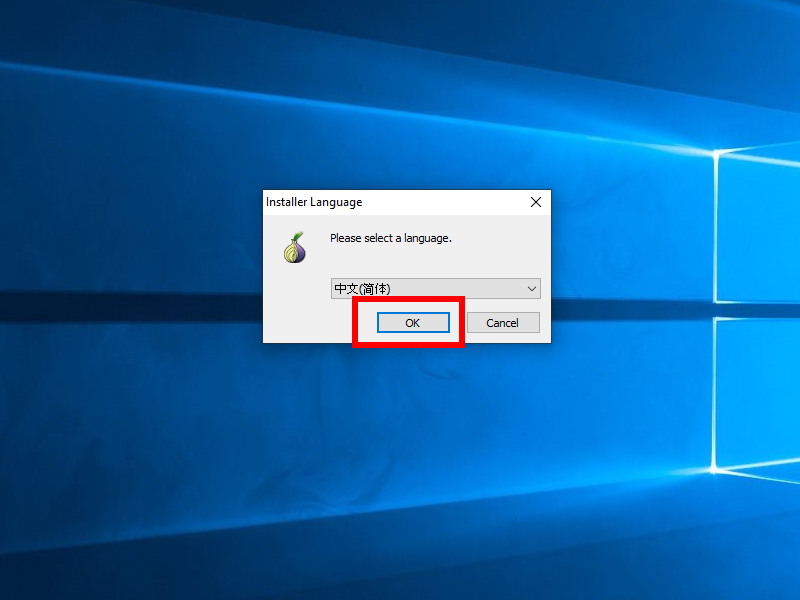
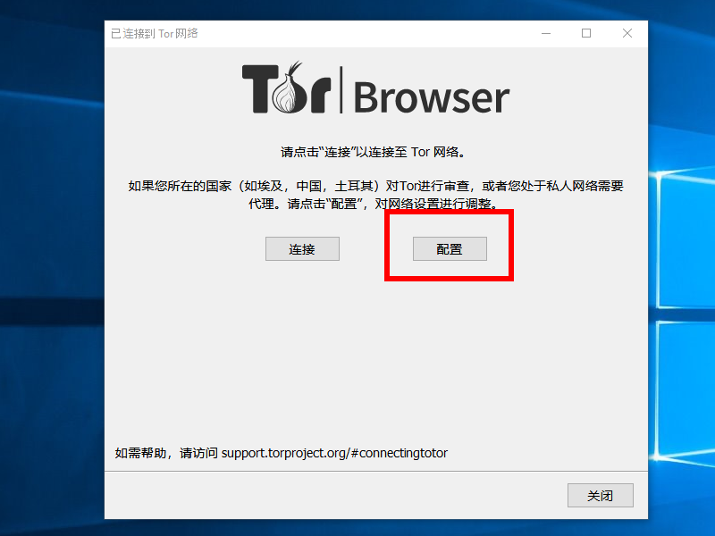
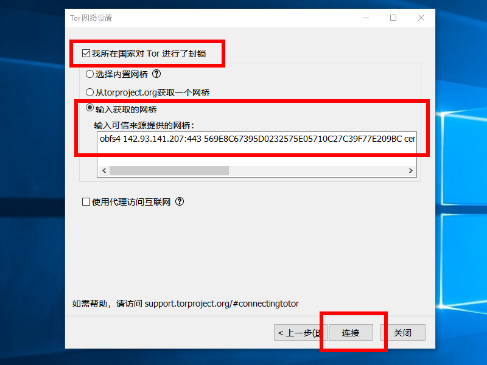
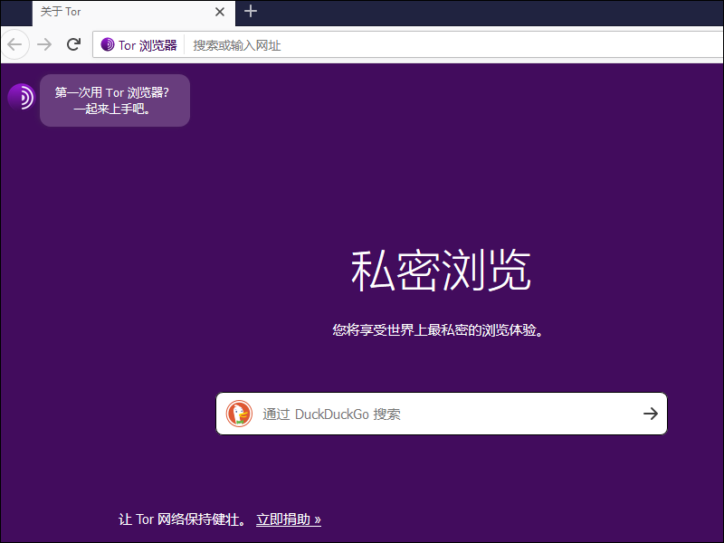
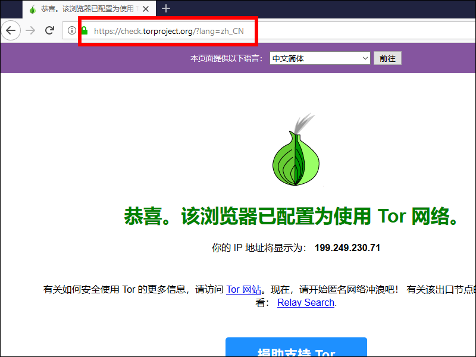

# Does GFW Block Private Tor Obfs4 Bridges?

[1. Introduction](#user-content-1-introduction)

[2. Get Bridge Line](#user-content-2-get-bridge-line)

[3. Get Tor Browser](#user-content-3-get-tor-browser)

[4. Configure Tor Browser with Known Obfs4 Bridge](#user-content-4-configure-tor-browser-with-known-obfs4-bridge)

[5. Test](#user-content-5-test)

[6. Report Results](#user-content-6-report-results)

[7. Bibliography](#user-content-7-bibliography)

## 1. Introduction

Here is how to test if the GFW blocks private Tor obfs4 bridges.

## 2. Get Bridge Line

The first thing you need is the "bridge line" of a private Tor obfs4 bridge.

## 3. Get Tor Browser

The normal way to download the Tor Browser is from the official Tor Project website at https://www.torproject.org

In countries where the Tor Project website is blocked, you can alternatively download from https://github.com/TheTorProject/gettorbrowser. These downloads may be less up-to-date than the ones on the official website.

## 4. Configure Tor Browser with Known Obfs4 Bridge

On macOS (OSX), you will need to double-click on the downloaded `dmg` file and drag Tor Browser to your Applications folder. 

On Linux, you will need to:

* Open a terminal emulator
* Change into your `Downloads` directory
* Extract the setup file contents, for example, `tar -xvJf tor-browser-linux64-8.5.3_zh-CN.tar.xz`
* Change into the extracted Tor browser directory
* Type `./start-tor-browser.desktop` to start the setup process

On Windows, double-click the downloaded Tor Browser install `exe` file.

The installation process is then similar on macOS, Linux, and Windows.

Select your language and click **OK**.

Follow the prompts to install Tor Browser. When done, leave the boxes checked to **Run Tor Browser** and **Add Start Menu & Desktop shortcuts**. Click **Finish**.

When Tor Browser runs for the first time, click **Configure**.

Check the box for **Tor is censored in my country**. Select the radio button for **Provide a bridge I know**. Paste your bridge line into the box. Click **Connect**.

Tor Browser attempts to connect to the Tor network via the bridge you provided.

If the connection is successful, the Tor start page appears.

In the Tor Browser, visit the Tor check page at https://check.torproject.org/?lang=zh_CN

## 5. Test

Once you have successfully visited the Tor check page, you can continue with tests of your own.

## 6. Report Results

Publish your findings. Did the bridge work? How was the speed? Did you have any problems? Do you have any other suggestions or comments?

* You can add a comment on the Tor Blog https://blog.torproject.org/tors-new-anti-censorship-team-defending-open-internet
* You can post on the subreddit for Tor https://www.reddit.com/r/TOR/

## 7. Bibliography

[1] Cecylia Bocovich, Roger Dingledine, Alexander Færøy, Kat Hanna, Philipp Winter, and Taylor Yu. "Addressing Denial of Service Attacks on Free and Open Communication on the Internet." https://research.torproject.org/techreports/dos-censorship-report2-2019-05-31.pdf

[2] Arun Dunna, Ciaran O'Brien, and Phillopa Gill. "Analyzing China's Blocking of Unpublished Tor Bridges." https://censorbib.nymity.ch/pdf/Dunna2018a.pdf

[3] Maikel. "Progress in censorship circumvention: overview of Tor and Pluggable transports." https://maikel.pro/blog/progress-in-censorship-circumvention-tor-and-pluggable-transports-an-overview

[4] David Fifield and Lynn Tsai. "Censors' Delay in Blocking Circumvention Proxies." https://www.usenix.org/conference/foci16/workshop-program/presentation/fifield

[5] David Fifield, Lynn Tsai, and Qi Zhong. "Detecting Censor Detection." https://arxiv.org/abs/1709.08718

[6] David Fifield and Lynn Tsai. "Proxy Blocking Latency." https://pdfs.semanticscholar.org/1586/ced0ef7fe6ff2b331de8e9872144f318a8d6.pdf

[7] Mohammad Hassan Mojtahed Soleimani, Muharram Mansoorizadeh, and Mohammad Nassiri. "Real-time identification of three Tor pluggable transports using machine learning techniques." https://link.springer.com/article/10.1007/s11227-018-2268-y
